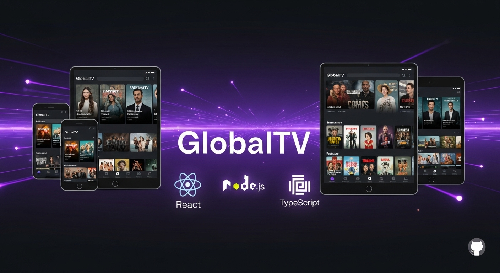
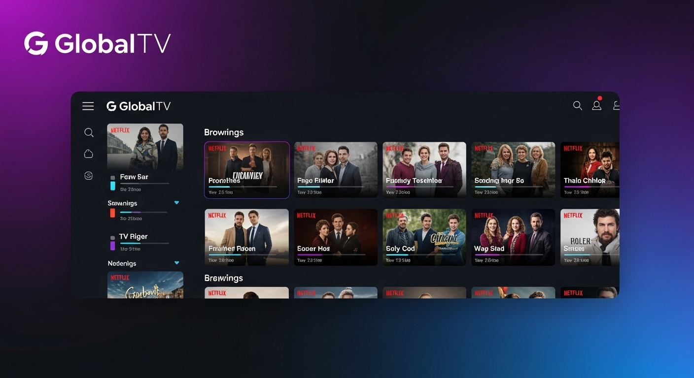
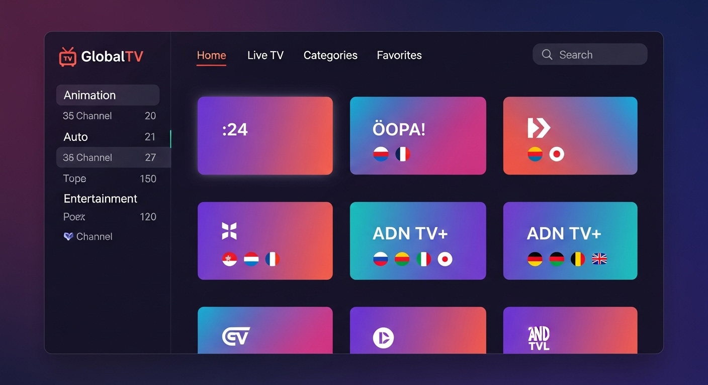
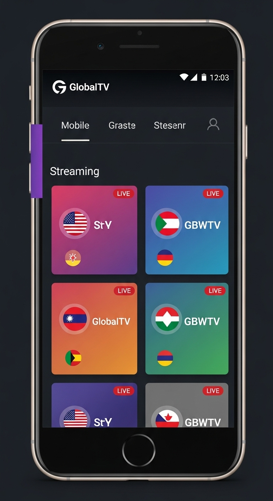
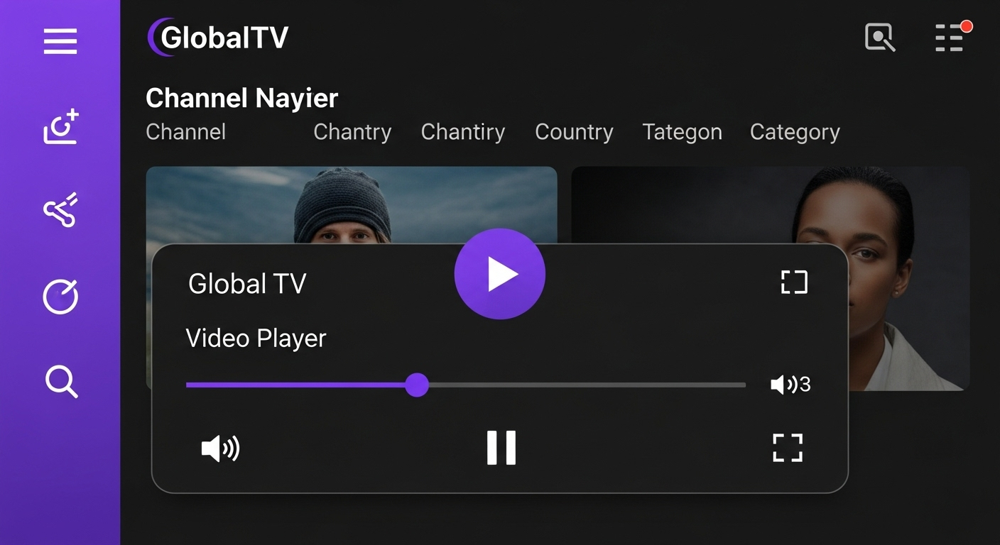

# 📺 GlobalTV - Streaming TV din întreaga lume





O aplicație modernă de streaming TV care îți permite să vizionezi canale live din întreaga lume, cu o interfață similară Netflix și funcționalități avansate.

## ✨ Caracteristici

- 🌍 **Peste 10.000 de canale TV** din întreaga lume
- 🔍 **Căutare și filtrare** după țară, categorie și nume
- 📱 **Design responsiv** - funcționează perfect pe mobile și desktop
- 🎬 **Video player avansat** cu suport HLS.js pentru streaming adaptiv
- ❤️ **Sistem de favorite** pentru canalele preferate
- 🏴 **Steaguri de țări** și organizare pe categorii
- 🌙 **Temă întunecată modernă** cu accente purple și albastru

## 🖼️ Preview-uri

### Interface Desktop Principal


### Interface Mobile Responsivă


### Video Player Integrat


## 🚀 Tehnologii folosite

### Frontend
- **React 18** cu TypeScript
- **Tailwind CSS** pentru styling
- **Shadcn/UI** pentru componente
- **TanStack Query** pentru state management
- **HLS.js** pentru streaming video
- **Wouter** pentru routing

### Backend
- **Node.js** cu Express
- **TypeScript** 
- **Drizzle ORM** cu PostgreSQL
- **Zod** pentru validare

### Streaming
- **IPTV-ORG** - Surse de canale gratuite
- **TVMaze API** - Metadata pentru canale
- **HLS.js** - Streaming adaptiv

## 📋 Instalare și rulare

### Cerințe preliminare
- Node.js 20+
- npm sau pnpm

### Pași de instalare

1. **Clonează repository-ul**
```bash
git clone https://github.com/your-username/globaltv.git
cd globaltv
```

2. **Instalează dependințele**
```bash
npm install
```

3. **Pornește aplicația**
```bash
npm run dev
```

4. **Deschide în browser**
Accesează `http://localhost:5000` în browserul tău.

## 🎯 Cum să folosești

1. **Explorează canalele** - Navighează prin grilă sau folosește sidebar-ul
2. **Filtrează după țară** - Selectează țara dorită din sidebar
3. **Caută canale** - Folosește bara de căutare din header
4. **Vizionează live** - Dă click pe orice canal pentru a începe streaming-ul
5. **Adaugă la favorite** - Apasă butonul inimă pentru a salva canalele preferate

## 🛠️ Structura proiectului

```
├── client/              # Frontend React
│   ├── src/
│   │   ├── components/  # Componente UI
│   │   ├── pages/       # Pagini aplicație
│   │   ├── lib/         # Utilitare și configurări
│   │   └── hooks/       # Custom React hooks
├── server/              # Backend Express
│   ├── services/        # Servicii pentru IPTV și TVMaze
│   └── routes.ts        # API endpoints
├── shared/              # Tipuri partajate
└── attached_assets/     # Imagini și assets
```

## 🔧 API Endpoints

- `GET /api/channels` - Lista toate canalele cu filtrare
- `GET /api/countries` - Lista țărilor disponibile
- `GET /api/categories` - Lista categoriilor
- `POST /api/channels/load-iptv` - Încarcă canale din IPTV
- `GET /api/proxy/stream` - Proxy pentru streaming CORS

## 🎨 Design și UX

Aplicația folosește o paletă de culori moderne cu temă întunecată:
- **Background**: Gri foarte întunecat pentru confort vizual
- **Primary**: Purple vibrant (#a855f7) pentru accente
- **Secondary**: Albastru pentru elemente secundare
- **Cards**: Tonuri mai deschise de gri pentru contrast

## ⚖️ Aspecte legale

Aplicația folosește doar:
- ✅ Canale TV publice și gratuite
- ✅ API-uri open source (IPTV-ORG, TVMaze)
- ✅ Surse de streaming legale și publice

**Notă**: Utilizatorii sunt responsabili să respecte legile locale privind vizionarea conținutului TV.

## 🤝 Contribuții

Contribuțiile sunt binevenite! Te rog să:
1. Fork repository-ul
2. Creează o branză pentru feature-ul tău
3. Commit modificările
4. Push la branză
5. Deschide un Pull Request

## 🎨 Asset-uri generate

Toate imaginile și mockup-urile din acest proiect au fost create special pentru aplicație:

- **Logo GlobalTV**: `./attached_assets/generated_images/GlobalTV_logo_design_a60d0fe4.png`
- **Hero Banner**: `./attached_assets/generated_images/GlobalTV_hero_banner_mockup_71b62d77.png`
- **Desktop Screenshot**: `./attached_assets/generated_images/Desktop_interface_screenshot_de552309.png`
- **Mobile Interface**: `./attached_assets/generated_images/Mobile_app_interface_mockup_27a48446.png`
- **Features Showcase**: `./attached_assets/generated_images/Features_showcase_collage_3a92a4e6.png`
- **Figma Mockup**: `./attached_assets/generated_images/Figma_design_mockup_b2c6534a.png`
- **GitHub Banner**: `./attached_assets/generated_images/GitHub_repository_banner_c46794c1.png`

## 🔧 Dezvoltare

### Rulare în modul dezvoltare
```bash
npm run dev
```
Acest command pornește serverul Express pe portul 5000 și Vite dev server-ul pentru frontend.

### Build pentru producție
```bash
npm run build
```

### Variabile de mediu
```env
NODE_ENV=development
DATABASE_URL=your_postgres_url
```

## 🎯 Planuri viitoare

- [ ] Sistem de autentificare utilizatori
- [ ] Ghid EPG (Electronic Program Guide)
- [ ] Înregistrare de programe
- [ ] Chat live pentru canale
- [ ] Recomandări personalizate
- [ ] Aplicație mobile nativă

## 📊 Statistici

- **10.000+** canale TV din întreaga lume
- **150+** țări reprezentate
- **20+** categorii de conținut
- **Gratuit și open source**

## 📧 Contact

Pentru întrebări sau suport, deschide un issue pe GitHub.

---

**Dezvoltat cu ❤️ pentru comunitatea de streaming TV din România și din întreaga lume**